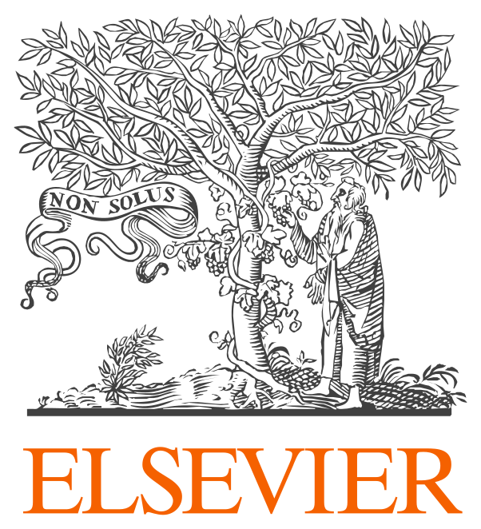

# Submission

## Proceedings

IHCUS-AI 2026 accepted papers will be published by Elsevier Science in the open-access [Procedia Computer Science](https://www.sciencedirect.com/journal/procedia-computer-science) series on-line. [Procedia Computer Science](https://www.sciencedirect.com/journal/procedia-computer-science) is hosted by [Elsevier](https://www.elsevier.com) and on the Elsevier content platform [ScienceDirect](https://www.sciencedirect.com), and will be freely available worldwide. 

All papers in Procedia will be indexed by [Scopus](https://www.scopus.com) and by [Clarivate's Conference Proceedings Citation Index](https://clarivate.com/products/scientific-and-academic-research/research-discovery-and-workflow-solutions/web-of-science/web-of-science-core-collection/). All papers in Procedia will also be indexed by [Engineering Village (Ei)](https://www.engineeringvillage.com), including [EI Compendex](https://www.elsevier.com/solutions/engineering-village/content/compendex). Moreover, all accepted papers will be indexed in [DBLP](https://dblp.org/). The papers will contain linked references, XML versions, and citable DOI numbers.

## Submission Guidelines

All workshop accepted papers will be included in the conference proceeding published by Elsevier Science in the open-access [Procedia Computer Science](https://www.sciencedirect.com/journal/procedia-computer-science) series on-line.

The submitted paper must be formatted according to the guidelines of [Procedia Computer Science](https://www.elsevier.com/journals/procedia-computer-science/1877-0509/guide-for-authors), [MS Word Template](https://cs-conferences.acadiau.ca/euspn-25/templates/EUSPN25_PROCS_Template.docx), [Latex](https://cs-conferences.acadiau.ca/euspn-25/templates/EUSPN25_PROCS_Template.zip), or [Template Generic](https://cs-conferences.acadiau.ca/euspn-25/templates/EUSPN25_Template-Generic.pdf). You are invited to submit papers in PDF format via our submission system, not exceeding **6** pages in length in single-column format including diagrams and references, and following the Procedia Computer Science guidelines. Papers that do not follow these guidelines may be rejected without consideration of their merits.

All papers will be reviewed by at least two Program Committee members on the basis of technical quality, originality, clarity, and relevance to the track topics. At least one author of each paper must attend the workshop to present the paper.

Authors are requested to submit their papers electronically using the online conference management system in PDF format before the deadline.

**[Submit via EasyChair](https://easychair.org/my/conference?conf=ihcusai2026)**